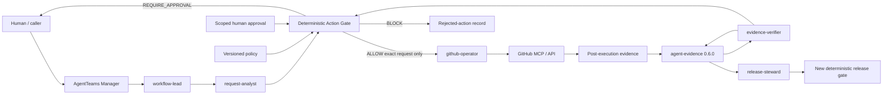

# Reference architecture

The experimental reference implementation enforces a fail-closed boundary between agent reasoning and external action. The AgentTeams resource template is pinned but not live-deployed in the retained demo.



## Components and authority

| Component | Handles uncertainty | Deterministic | Grants action authority |
|---|---:|---:|---:|
| AgentTeams Manager/Workers | yes | no | no |
| `agent-evidence` verifier | no | yes for its verification contract | no |
| Policy evaluator | no | yes | provides policy result, not execution |
| Action Gate | no | yes | returns one bounded decision |
| Human approver | yes | records an explicit scoped decision | only within recorded scope |
| Provider MCP | no | tool-dependent | no; consumes a prior `ALLOW` and provider ACL |

The Manager routes tasks and maintains visibility. It is not a central intelligent controller and cannot override the gate. Workers have one narrow responsibility and no worker can both request, approve, execute, and attest the same action.

## Trust boundaries

1. Agent output is untrusted input until schema validation.
2. Evidence bytes and claims are untrusted until the pinned `agent-evidence` result is verified.
3. An evidence result says whether a bundle satisfies that verifier; it is not policy or authorization.
4. Policy data and human approval records are versioned gate inputs. Unknown, expired, revoked, mismatched, or unsigned inputs fail closed.
5. An `ALLOW` binds `request_id`, action, provider target, parameters digest, policy version, evidence digest, approval reference, and expiry. Any mutation requires re-evaluation.
6. Provider credentials remain outside agents, prompts, Skills, fixtures, and decision receipts.
7. Post-execution and release are separate phases with new evidence and a new decision.

## State sequence

```text
DRAFT -> ANALYZED -> EVIDENCE_VERIFIED -> DECIDED
  -> APPROVAL_PENDING -> DECIDED
  -> EXECUTION_ATTEMPTED -> EXECUTION_EVIDENCE_VERIFIED
  -> RELEASE_DECIDED
```

`DECIDED=ALLOW` is never rewritten into an execution-success claim. Runtime transitions are stored in a SQLite append-only hash chain; retained failures are part of the evidence trail. The store is a single-node reference, not a production tamper-proof ledger.

## Dependency direction

```text
AgentTeams -> this project's Skills and MCP contracts
Action Gate -> versioned local schemas and policy snapshot
Evidence adapter -> pinned agent-evidence public API/CLI
GitHub operator -> exact ALLOW receipt -> provider MCP
```

TITMAS core protocols are upstream constraints, not code copied into or modified by this project. Any future divergence requires a separate architecture decision and DBA review.
